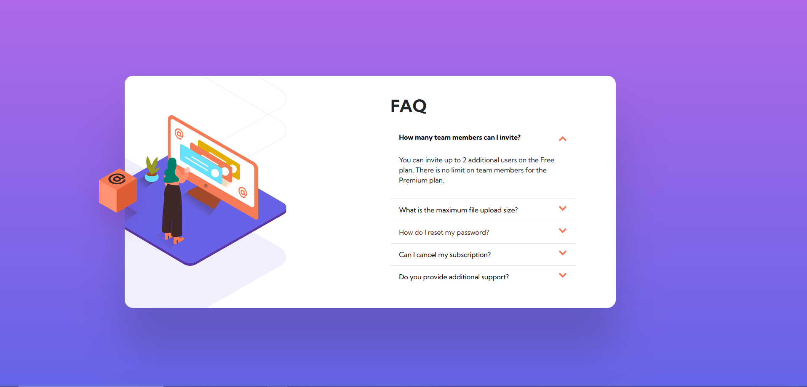
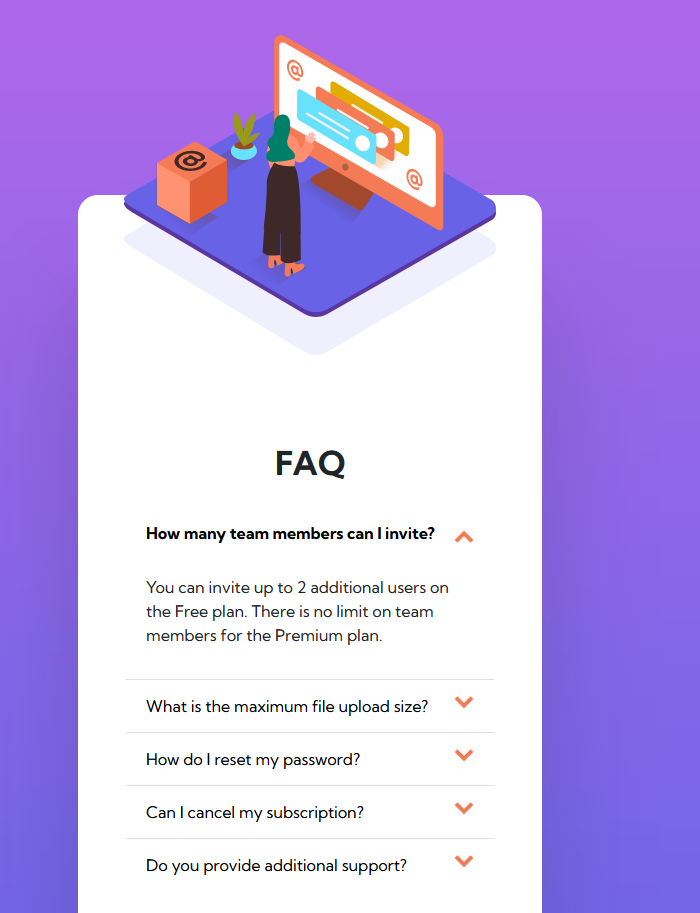

# Frontend Mentor - FAQ accordion card solution

This is a solution to the [FAQ accordion card challenge on Frontend Mentor](https://www.frontendmentor.io/challenges/faq-accordion-card-XlyjD0Oam). Frontend Mentor challenges help you improve your coding skills by building realistic projects.

## Table of contents

- [Overview](#overview)
  - [The challenge](#the-challenge)
  - [Screenshot](#screenshot)
  - [Links](#links)
- [My process](#my-process)
  - [Built with](#built-with)
  - [What I learned](#what-i-learned)
- [Author](#author)
- [Acknowledgments](#acknowledgments)

## Overview
Simple 1 page responsive card design.

### The challenge

Users should be able to:

- View the optimal layout for the component depending on their device's screen size
- See hover states for all interactive elements on the page
- Hide/Show the answer to a question when the question is clicked

### Screenshot

### Links

- Solution URL: https://github.com/ajay0024/faq-accordion-card-main
- Live Site URL: https://ajay0024.github.io/faq-accordion-card-main

### Built with

- Semantic HTML5 markup
- CSS custom properties
- Flexbox
- Mobile-first workflow
- Bootstrap

### What I learned
The design specially the floating images were challenging.

## Author

- Website - https://ajay0024.github.io/cv/
- Frontend Mentor - https://www.frontendmentor.io/profile/ajay0024
- Twitter - https://twitter.com/Python72000166

## Acknowledgments

This was inspirational. Will do more
